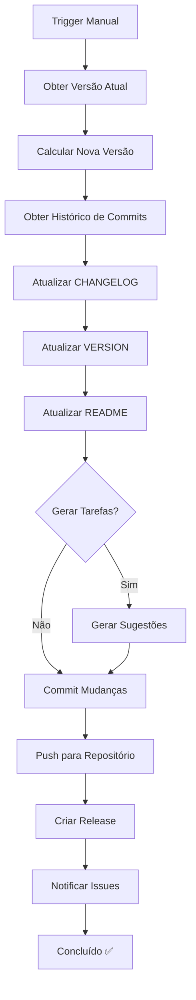

# 📝 Guia da Ação "Update" - Atualização Automática do Projeto

## 🎯 Visão Geral

A ação **Update** é um workflow automatizado do GitHub Actions que:

1. **Atualiza a documentação** automaticamente quando um agente completa trabalho
2. **Incrementa a versão** seguindo Semantic Versioning
3. **Atualiza o CHANGELOG** com resumo das mudanças
4. **Gera sugestões de tarefas** baseadas em análise competitiva
5. **Cria releases** automaticamente no GitHub

## 🚀 Como Usar

### Executar Manualmente

1. Vá para a aba **Actions** no GitHub
2. Selecione o workflow **"Update - Auto Changelog and Task Generator"**
3. Clique em **"Run workflow"**
4. Preencha os campos:
   - **agent_summary**: Resumo do trabalho realizado
   - **version_bump**: Tipo de incremento de versão (patch/minor/major)
   - **generate_tasks**: Se deve gerar sugestões de tarefas (true/false)
5. Clique em **"Run workflow"**

### Exemplo de Uso

```yaml
# Inputs de exemplo:
agent_summary: |
  Implementado sistema de notificações push
  - Criado service worker para notificações
  - Adicionado botão para solicitar permissão
  - Implementado agendamento de lembretes
  - Testado em Chrome, Firefox e Safari

version_bump: minor  # De 2.0.0 para 2.1.0

generate_tasks: true  # Gera novas sugestões de tarefas
```

## 📊 Tipos de Versão (Semantic Versioning)

### Patch (x.x.X)
**Quando usar:**
- Correção de bugs
- Pequenas melhorias de performance
- Correções de documentação
- Correções de segurança menores

**Exemplo:**
- 2.0.0 → 2.0.1
- Mudanças compatíveis

### Minor (x.X.0)
**Quando usar:**
- Novas funcionalidades
- Melhorias significativas
- Novos recursos não-breaking
- Depreciação de features (mas ainda funcionam)

**Exemplo:**
- 2.0.0 → 2.1.0
- Compatível com versão anterior

### Major (X.0.0)
**Quando usar:**
- Breaking changes
- Mudanças incompatíveis na API
- Remoção de features depreciadas
- Redesign completo
- Mudanças no banco de dados

**Exemplo:**
- 2.0.0 → 3.0.0
- Pode quebrar compatibilidade

## 📋 O Que a Ação Faz

### 1. Atualiza CHANGELOG.md ✅

Adiciona uma nova entrada com:
- Número da versão
- Data da atualização
- Resumo do agente
- Lista de commits incluídos
- Tipo de atualização

**Exemplo de entrada gerada:**

```markdown
## [2.1.0] - 2025-11-16

### 🤖 Atualização Automática - Agent Update

**Tipo de Atualização:** MINOR

**Resumo das Mudanças:**
Implementado sistema de notificações push
- Criado service worker para notificações
- Adicionado botão para solicitar permissão
- Implementado agendamento de lembretes
- Testado em Chrome, Firefox e Safari

### 📝 Commits Incluídos
- feat: add push notifications (abc1234)
- test: add notification tests (def5678)
- docs: update notification guide (ghi9012)

### ✨ Melhorias e Correções
- Documentação atualizada automaticamente
- Changelog atualizado com novas mudanças
- Versão incrementada seguindo Semantic Versioning
```

### 2. Atualiza VERSION.md ✅

- Incrementa o número da versão
- Atualiza data de lançamento
- Atualiza data de última modificação

### 3. Atualiza README.md ✅

- Atualiza o badge de versão
- Mantém o resto do conteúdo intacto

### 4. Gera Sugestões de Tarefas 📋

Cria um arquivo em `docs/TASK-SUGGESTIONS-YYYYMMDD.md` com:

#### Análise Competitiva
- MyFitnessPal
- Strava
- Fitbit App
- Strong
- Cronometer

#### Tarefas Sugeridas

**Curto Prazo (1-2 meses):**
- PWA completo
- Dark mode
- Export/Import aprimorado
- Notificações push
- Calculadoras
- Templates personalizados

**Médio Prazo (3-6 meses):**
- Integração com wearables
- IA para sugestões
- Recursos sociais
- Desafios e gamificação
- Biblioteca de exercícios
- Tracking de água

**Longo Prazo (6-12 meses):**
- Backend e API
- Apps mobile nativos
- Marketplace de treinos
- Versão Premium/Pro

#### Oportunidades de Mercado
- Nichos não explorados
- Diferenciais competitivos
- Métricas de sucesso (KPIs)

### 5. Cria Release no GitHub 🏷️

- Cria uma tag `vX.Y.Z`
- Cria uma release com o resumo
- Link para o CHANGELOG

### 6. Notifica Issues Relacionadas 🔔

Comenta em issues abertas com label `enhancement`:
- Notifica sobre nova versão
- Link para sugestões de tarefas
- Convida para revisar mudanças

## 📁 Arquivos Modificados

```
.
├── CHANGELOG.md                          # ✏️ Atualizado
├── VERSION.md                            # ✏️ Atualizado
├── README.md                             # ✏️ Atualizado
└── docs/
    └── TASK-SUGGESTIONS-YYYYMMDD.md     # 📄 Novo arquivo
```

## 🔄 Workflow Completo



## 💡 Casos de Uso

### Caso 1: Agent Completa Feature
```yaml
agent_summary: |
  Implementado dark mode completo
  - Adicionado toggle no menu
  - Cores otimizadas para contraste
  - Preferência salva no localStorage
  - Testado em todos os navegadores

version_bump: minor  # Nova feature
generate_tasks: true
```

### Caso 2: Correção de Bug
```yaml
agent_summary: |
  Corrigido bug no cálculo de macros
  - Proteína agora calcula corretamente
  - Adicionada validação de valores negativos

version_bump: patch  # Bug fix
generate_tasks: false  # Não precisa de novas tarefas
```

### Caso 3: Breaking Change
```yaml
agent_summary: |
  Migração para novo sistema de banco de dados
  - Atualizado de IndexedDB v6 para v7
  - Nova estrutura de usuários
  - Script de migração automática
  ⚠️ BREAKING: Requer reload completo da página

version_bump: major  # Breaking change
generate_tasks: true
```

## 🎯 Melhores Práticas

### ✅ Fazer

1. **Resumos Claros**: Descreva claramente o que foi feito
2. **Listar Mudanças**: Use bullet points para clareza
3. **Mencionar Testes**: Sempre mencione o que foi testado
4. **Usar Emojis**: Tornam o changelog mais legível
5. **Ser Específico**: Mencione arquivos ou componentes modificados

### ❌ Evitar

1. ❌ Resumos vagos: "Fiz várias coisas"
2. ❌ Sem contexto: "Atualização"
3. ❌ Muito técnico: Evite jargão excessivo
4. ❌ Muito curto: "Fix"
5. ❌ Informações sensíveis: Senhas, keys, etc.

## 🔐 Permissões Necessárias

A ação requer as seguintes permissões:

```yaml
permissions:
  contents: write        # Para commit e push
  pull-requests: write   # Para comentar em PRs
  issues: write          # Para comentar em issues
```

Estas são configuradas automaticamente no workflow.

## 🐛 Troubleshooting

### Problema: "No changes to commit"

**Causa:** Nenhum arquivo foi modificado
**Solução:** Verifique se os arquivos existem e têm conteúdo válido

### Problema: "Permission denied"

**Causa:** Token do GitHub sem permissões
**Solução:** Verifique as permissões do workflow

### Problema: "Release already exists"

**Causa:** Tag já existe no repositório
**Solução:** Normal, o workflow continua mesmo se a release existir

### Problema: "Failed to update VERSION.md"

**Causa:** Formato do arquivo pode estar incorreto
**Solução:** Verifique se VERSION.md contém "Versão Atual: X.Y.Z"

## 📖 Exemplos de Resumos

### Exemplo 1: Feature Completa
```
Implementado sistema de PWA completo
- Adicionado service worker com cache strategy
- Criado manifest.json com ícones
- Implementado offline fallback page
- Adicionado botão "Instalar App"
- Testado instalação no Chrome, Edge e Firefox
- Funciona 100% offline após primeiro carregamento

Impacto: Usuários podem instalar como app nativo
Plataformas: Desktop e Mobile
Performance: Cache reduz tempo de carregamento em 80%
```

### Exemplo 2: Múltiplas Correções
```
Correções de bugs e melhorias de UX
- Corrigido bug no cálculo de percentual de gordura
- Corrigido scroll infinito na lista de refeições
- Melhorado contraste de botões para acessibilidade
- Corrigido crash ao fazer upload de foto >5MB
- Otimizada query do IndexedDB (50% mais rápido)

Bugs resolvidos: 5
Issues fechadas: #45, #47, #48
Impacto: Experiência mais estável e rápida
```

### Exemplo 3: Melhorias de Segurança
```
Atualização crítica de segurança
- Corrigida vulnerabilidade XSS no campo de notas
- Atualizada biblioteca Chart.js para v4.4.1
- Implementado rate limiting mais agressivo (5 req/min)
- Adicionada validação de tamanho de upload (max 10MB)
- Melhorado sanitização de inputs em formulários

⚠️ CRÍTICO: Atualização recomendada imediatamente
Vulnerabilidades corrigidas: 1 (CVE-2024-XXXXX)
Conformidade: OWASP Top 10
```

## 🎨 Personalização

### Modificar Template de Sugestões

Edite o arquivo `/tmp/task_suggestions.md` no workflow para customizar:
- Referências competitivas
- Categorias de tarefas
- Prioridades
- Formato

### Adicionar Mais Automações

Você pode estender o workflow para:
- Criar issues automaticamente
- Enviar notificações para Slack/Discord
- Atualizar documentação externa
- Trigger deploys automáticos
- Rodar testes de regressão

## 📊 Métricas e Análise

### Rastreamento de Releases

```bash
# Ver todas as releases
git tag -l "v*"

# Ver changelog de uma versão
git show v2.1.0:CHANGELOG.md

# Comparar duas versões
git diff v2.0.0..v2.1.0
```

### Análise de Frequência

```bash
# Releases no último mês
git tag -l "v*" --sort=-creatordate | head -5

# Commits desde última release
git log $(git describe --tags --abbrev=0)..HEAD --oneline
```

## 🔮 Futuras Melhorias

Planejadas para próximas versões da ação Update:

1. **AI-Powered Changelog**: Usar LLM para gerar resumos melhores
2. **Auto-Screenshot**: Capturar screenshots de mudanças de UI
3. **Dependency Analysis**: Detectar updates de dependências
4. **Security Scan**: Rodar scan de segurança automático
5. **Performance Metrics**: Comparar performance entre versões
6. **Multi-Language**: Gerar changelog em múltiplos idiomas
7. **Social Sharing**: Auto-post em redes sociais

## 📞 Suporte

### Problemas ou Dúvidas?

- 📖 Consulte este guia primeiro
- 🐛 Abra uma issue no GitHub
- 💬 Use GitHub Discussions para perguntas
- 📧 Email: taukkunen1@github.com

### Contribuir

Melhorias para a ação Update são bem-vindas! Abra um PR com:
- Descrição clara da melhoria
- Testes (se aplicável)
- Documentação atualizada

---

**Versão do Guia:** 1.0.0  
**Última Atualização:** 16 de Novembro de 2025  
**Autor:** taukkunen1  
**Mantido por:** Pilgrim Team
